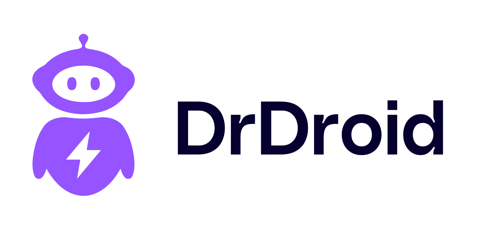

# Status Page Aggregator for SRE Teams

<div align="center">
  <a href="https://www.drdroid.io">
    
  </a>
</div>

**A production-ready status monitoring dashboard that SRE teams can fork and customize for their specific vendor dependencies.**

[](https://nextjs.org)
[](https://supabase.com)

## 🎯 Built for SRE Teams

**The Problem**: Your production system depends on 20+ external services (AWS, Stripe, OpenAI, Datadog, etc.). During incidents, engineers waste critical time checking multiple status pages to determine if issues are vendor-related.

**The Solution**: Deploy your own unified status dashboard that automatically monitors all your critical vendor dependencies. Get real-time updates and instant notifications when high-priority services experience issues.

## 🚀 Key Features

- **🔄 Automated Monitoring**: Fetches status from 50+ services via RSS/Atom feeds and APIs
- **⚡ Real-time Updates**: Supabase Edge Functions update status every minute
- **📧 Smart Notifications**: Email alerts only for high-priority service changes
- **🎨 Customizable**: Easy to add/remove services based on your stack
- **📱 Mobile-Ready**: Check status during on-call incidents

## 🏗️ Architecture

```
┌─────────────────┐    ┌──────────────────┐    ┌─────────────────┐
│   Next.js App   │◄───│   Supabase DB    │◄───│  Edge Function  │
│  (Frontend)     │    │ (service_status) │    │  (Status Sync)  │
└─────────────────┘    └──────────────────┘    └─────────────────┘
                                                        ▲
                                                        │
                                                ┌────────▼─────────┐
                                                │ External APIs &  │
                                                │   RSS/Atom      │
                                                └──────────────────┘
```

## 🚀 Quick Start

### 1. Fork and Clone

```bash
git clone https://github.com/YOUR_USERNAME/status-page-aggregator
cd status-page-aggregator
npm install
```

### 2. Setup Environment

Create `.env.local`:

```bash
# Supabase Configuration
NEXT_PUBLIC_SUPABASE_URL=https://your-project.supabase.co
NEXT_PUBLIC_SUPABASE_ANON_KEY=your-anon-key

# Email Configuration
EMAIL_HOST=smtp.gmail.com
EMAIL_PORT=587
EMAIL_USER=your-email@gmail.com
EMAIL_PASS=your-app-password
SLACK_EMAIL=sre-team@yourcompany.com
```

### 3. Follow Setup Guides

| Step               | Documentation                              | What It Covers                                                                 |
| ------------------ | ------------------------------------------ | ------------------------------------------------------------------------------ |
| **Database Setup** | [`SUPABASE_SETUP.md`](./SUPABASE_SETUP.md) | Create Supabase project, database schema, edge functions, automated scheduling |
| **Customization**  | [`CUSTOMIZATION.md`](./CUSTOMIZATION.md)   | Add your services, configure notifications, customize UI, email providers      |

### 4. Deploy

```bash
npm run build
vercel --prod  # or your preferred hosting
```

## 🤝 Contributing

This project is designed for forking and customization. Consider contributing back:

- **New service integrations** that benefit the SRE community
- **Bug fixes** for parsing edge cases
- **Performance improvements** for large-scale deployments
- **Documentation improvements** for additional deployment platforms

## 📞 Support & Community

- 🐛 [Report Issues](https://github.com/DrDroidLab/status-page-aggregator/issues)
- 💬 [Discussions](https://github.com/DrDroidLab/status-page-aggregator/discussions)

## 📄 License

MIT License - Fork, customize, and deploy for your team!

---

**Built with ❤️ by DrDroid team for SRE teams worldwide**
